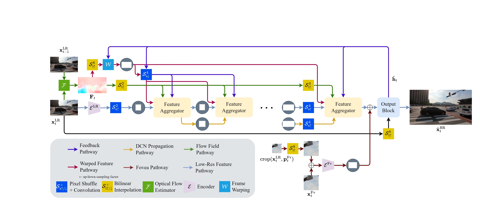

# Cross-Resolution-Flow-Propagation-for-Foveated-Video-Super-Resolution

Official implementation of Cross-Resolution Flow Propagation for Foveated Video Super-Resolution (CRFP) accepted by WACV 2023.




## Training and evaluation
To train the model, you need to install DCN first from https://github.com/jinfagang/DCNv2_latest

Run the following to start training
```
bash train.sh
```

To evaluate, run
```
bash eval.sh
```

To test, run
```
bash test.sh
```

## References
Most of the code is referenced from

1. TTSR: https://github.com/researchmm/TTSR
2. BasicVSR: https://github.com/open-mmlab/mmediting


